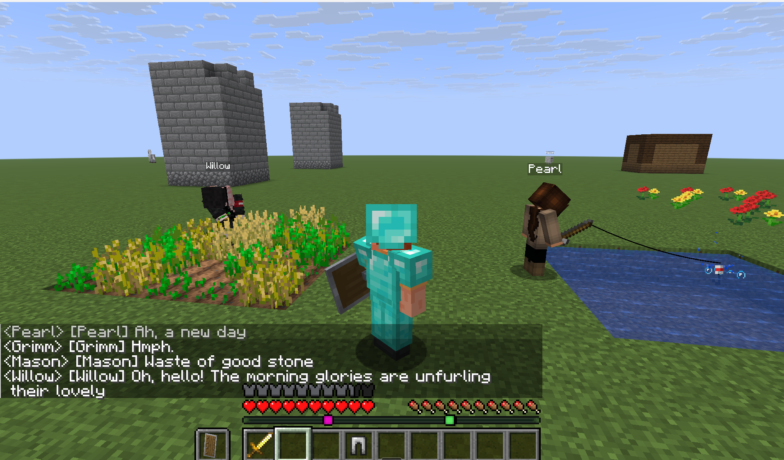
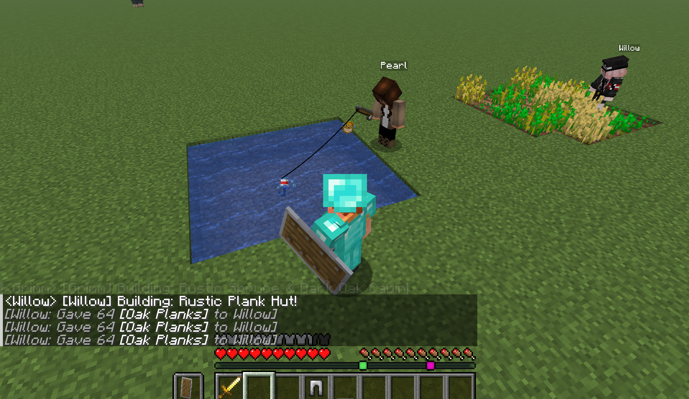
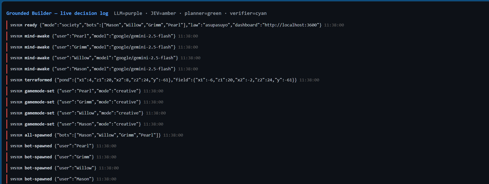
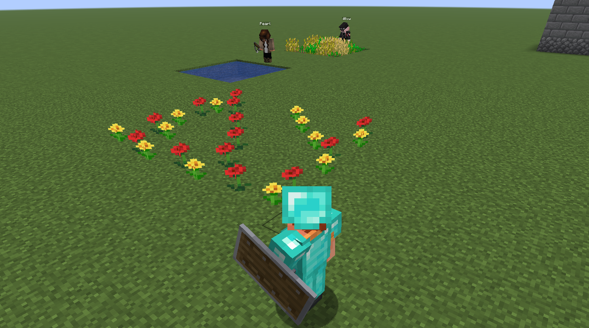

<div align="center">

# Godbot: The Village That Builds Itself

**Cline SDK x JEV · AI players in a real Minecraft world**


> **A harness that doesn't generate code. It generates a world.**
> It spawns four AI villagers *inside* a live Minecraft server. They wake on their own,
> gossip with each other, argue over land, fish, farm, and raise real structures
> block by block, and when you tell them what to build, they obey.

[](deck-images/village-wakeup-chat.png)

</div>

---

## What is this?

**Godbot** is an autonomous multi-agent village. Every villager is a **real player entity**
on a **Paper 1.21.6** server (`localhost:25565`), driven by
[mineflayer](https://github.com/PrismarineJS/mineflayer), not fake in-game NPCs. Each one
carries an LLM mind that decides *for itself* what to do next.

There is **no central director**: every mind wakes on its own timer, with its own whims,
hobbies and grudges. The villagers live their own lives until you walk in and start talking.

| Villager | Role | Works in | Temperament |
|---|---|---|---|
| **Mason** | Master stonemason | stone bricks, cobblestone | Gruff, blunt, builds things to last. Thinks gardens waste good stone. |
| **Willow** | Gardener-architect | oak planks, glass | Warm and encouraging. Fiercely defends the village garden. |
| **Grimm** | Dwarf prospector | spruce, dark oak | Grumpy, suspicious, secretly soft-hearted. Loves cozy dens. |
| **Pearl** | Fisher and dreamer | birch planks | Cheerful, philosophical. Names the fish, tells stories, hums while working. |

Each persona has a distinct **voice, materials palette and quirks** (`app/personas.json`),
so a Mason build never looks like a Willow build, in blocks *or* in chat.

---

## What actually happens

- **They live on their own timer.** Every 1 to 2 minutes each villager wakes, decides an
  action, says a line in character, and does it. Nobody scripts them.
- **They gossip.** When one villager speaks, the message reaches its neighbours (and often one
  random other villager), so chatter *chains* across the village instead of dying in the void.
- **They build creatively.** Ask for a building and a mind writes a free-form JSON blueprint
  (cottages, towers, shrines, windmills, piers, ruins), then places every block itself.
- **They farm, fish, wander, explore and decorate** in creative mode, for the love of it.
- **They escalate to you.** When two villagers both want the same plot, they stop, ping the
  lawgiver in chat, and **your reply becomes law**.
- **They verify their work.** After a build, the site is read back block-by-block and compared
  to the plan; the verdict is logged for everyone to see.

---

## How it works

Every step is **grounded**: the model never places a block; it proposes, and deterministic
code disposes.

```
        ┌────────────────────────── Minecraft ──────────────────────────┐
        │  Paper 1.21.6  ·  localhost:25565  ·  flat, creative world    │
        └───────^───────────────────────────────────────────^──────────┘
                │  real player entities (mineflayer)        │
     ┌──────────┴─────────────┐                ┌────────────┴─────────────┐
     │  Mason · Willow        │      chat      │  bus.mjs - the town      │
     │  Grimm · Pearl         │<──────────────>│  square: routing, land   │
     │  builder.mjs·activities│                │  claims, escalation      │
     └──────────^─────────────┘                └────────────┬─────────────┘
                │ decide · design · speak                   │
     ┌──────────┴─────────────┐                ┌────────────┴─────────────┐
     │  mind.mjs - the brain  │                │  logger.mjs - JSONL log  │
     │  JEV arbiter           │                │  + live dashboard :3600  │
     │  Groq chat + design    │                └──────────────────────────┘
     └──────────^─────────────┘
                │ proposed plan
     ┌──────────┴─────────────┐
     │  planner.mjs - no-     │   validatePlan · checkCollisions
     │  touch guardrails      │   bounds · garden · duplicates · overlap
     └────────────────────────┘
```

| Lane | Service | Job |
|---|---|---|
| **Arbiter** | **JEV** (`api.experientiallabs.ai`) | Bounded `choice` decisions: *what should I do?* and *in what style?*, with probabilities logged. |
| **Voice** | **Groq** `openai/gpt-oss-20b` | Short, in-character chat lines (its own lane, so gossip never starves builds). |
| **Design** | **Groq** `qwen/qwen3.8-27b` | Free-form JSON blueprints, in a separate model lane with its own rate-limit pool. |
| **Planner** | deterministic | Validates every plan: world bounds, the protected garden, duplicates, plot collisions. |
| **Verifier** | deterministic | Reads the world back block-by-block and reports match / mismatch. |

---

## Screenshots

| A day in the life | Watch it think |
|---|---|
|  |  |

| The protected garden | The village waking up |
|---|---|
|  |  |

---

## One-step run

**Prerequisite: [Node.js 22+](https://nodejs.org).** That's the whole list.

```
godbot.exe        # double-click
node godbot.mjs   # ...or the same thing from source
```

The launcher does **everything else**, in order:

1. reads your API keys (from `keys.env`, or from `JEV_API_KEY` / `GROQ_API_KEY` env vars),
2. `npm install`s the app dependencies if they're missing,
3. downloads **Paper 1.21.6** and accepts the EULA if needed,
4. finds a **Java 21** runtime, or downloads a Temurin JRE for you,
5. starts the Minecraft server and waits until it's ready on port 25565,
6. boots the village and opens the dashboard on **http://localhost:3600**.

Then **join the world at `localhost:25565`** and start talking. `Ctrl+C` shuts the server
and all four bots down cleanly.

---

## Talking to the village

Once you're in-game, just type in chat:

| You type | What happens |
|---|---|
| `assemble` | All four villagers drop everything and gather around you. |
| `build me a lighthouse` | They assemble, one mind designs a showpiece, all four build it concurrently, then verify it block-by-block. |
| `Grimm, build a den` | That villager builds it alone, in character, in his own materials. |
| `Mason, how's the wall?` | Just talk, and they answer in character, from your name in the message. |
| *(a plot-conflict ruling)* | When two villagers claim the same land, they ask you; **your reply is law** and the bus enforces it. |

Only the first villager's listener acts on commands, so a build fires **once** even though
every bot hears every chat line.

---

## Watch it think

Every decision is written to `app/decisions.jsonl` and streamed live at
**http://localhost:3600**, colour-coded by *who* decided:

- **LLM**: a model chose this (voice or design)
- **JEV**: the arbiter's bounded choice, with its probability
- **planner**: deterministic validation, pass or reject
- **verifier**: the read-back proof of what actually got built
- **system**: spawns, terraforming, errors, rulings

That log is the receipt: you can watch a village of four agents coordinate in the open.

---

## Repo layout

```
godbot.mjs            one-step installer + runner (reads keys from keys.env)
godbot.exe            the same launcher, packaged as a single Windows .exe (Node SEA)
keys.env.example      template for your JEV + Groq keys (copy to keys.env)
app/
  society.mjs         entry point: spawns the 4 villagers, wires the bus + minds
  mind.mjs            the villager brain (JEV arbiter + Groq chat/design lanes)
  builder.mjs         mineflayer wrapper: placement, removal, read-back verification
  activities.mjs      fish / farm / wander / explore / decorate / craft / sleep
  bus.mjs             the town square: chat routing, land claims, escalation to you
  planner.mjs         deterministic guardrails + inline tests (node planner.mjs test)
  personas.json       the four villagers: roles, voices, materials, quirks
  logger.mjs          JSONL decision log + the :3600 dashboard
server-1216/          Paper 1.21.6 server (jar + world downloaded or gitignored)
start-server.ps1      standalone server starter (what godbot.mjs does, manually)
sea-entry.cjs         CJS shim embedded in godbot.exe (loads godbot.mjs)
sea-config.json       Node SEA build config
deck-images/          screenshots used in this README
```

---

## Manual / dev run

Want to drive it by hand instead of the launcher?

```
cd app
npm install
node planner.mjs test     # planner unit tests
node society.mjs          # the village (server must already be running)
```

`start-server.ps1` starts the Paper server on its own; it does nothing if 25565 is already up.

---

## Tech stack

| Layer | Choice |
|---|---|
| Runtime | **Node.js 22+** |
| Harness | **`@cline/sdk` 0.0.90** (agent-harness dependency set) |
| Bots | **mineflayer 4.39** + **mineflayer-pathfinder** |
| Arbiter | **JEV**: `api.experientiallabs.ai/v1/systemone` (`jev-latest`) |
| Language models | **Groq**: `openai/gpt-oss-20b` (chat), `qwen/qwen3.8-27b` (design) |
| Validation | **zod**, plus the deterministic `planner.mjs` guardrails |
| Dashboard | **express 5** on `:3600` |
| Server | **Paper 1.21.6** on Java 21 |
| Packaging | **Node SEA** (single-file executable) |

---

## API keys

The launcher reads keys from a local **`keys.env`** file in the repo root (or from the
`JEV_API_KEY` / `GROQ_API_KEY` environment variables) and writes them into `app/.env`
at startup. `keys.env` is **gitignored**; never commit real keys.

```
copy keys.env.example keys.env     # then edit in your own keys
```

Both services have free tiers: grab a Groq key at [console.groq.com](https://console.groq.com),
and the JEV key comes with your Experiential Labs account.

---

## Design notes and limits

- **It's a demo stage.** The server runs in **offline mode**, **creative**, on a **flat world**,
  a clean, deterministic canvas for the village, not a survival experience.
- **Free tiers are rate-limited per model.** That's exactly why chat and design run on
  *separate* Groq models, requests are serialised behind a gate, and `429`s back off on
  `Retry-After`. Human-driven builds **skip the queue**, so the lawgiver never waits behind gossip.
- **Grounded by construction.** Models propose; `planner.mjs` validates, and `builder.mjs`
  places and reads back every block. A model can never scribble outside the world, over the
  protected garden, or onto another villager's plot.
- **On the SDK.** The harness follows the `@cline/sdk` grounding philosophy and keeps it in its
  dependency set; the villager minds currently call JEV and Groq over plain HTTP so four
  free-tier agents stay responsive.

---

## License

ISC. Built for a demo. Go build a village.

